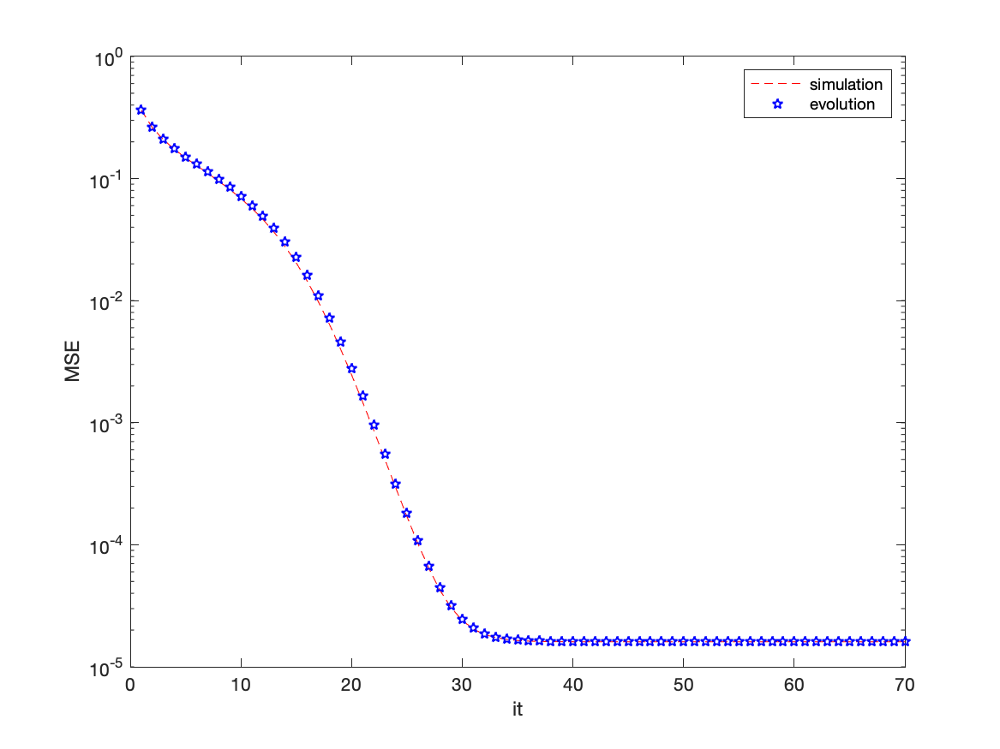

# Turbo compressed sensing with partial DFT sensing matrix

This repository contains the implementation of the **Turbo compressed sensing (Turbo-CS)** algorithm proposed in the paper:

> J. Ma, X. Yuan and L. Ping, "Turbo Compressed Sensing with Partial DFT Sensing Matrix," in *IEEE Signal Processing Letters*, vol. 22, no. 2, pp. 158-161, Feb. 2015, doi: 10.1109/LSP.2014.2351822.https://doi.org/10.1109/ACCESS.2017.2697978)

## Introduction

Turbo-CS is a turbo compressed sensing algorithm with partial discrete Fourier transform (DFT) sensing matrices.

## Code Structure

`TurboCS.m`: Denosing based Turbo compressed sensing algorithm.

- Input parameters
  - `lambda`: sparsity rate
  - `N`: input sparse vector size
  - `M`: measurement number
  - `NSIM`: simulation times
  - `SNRdB`: noise level
  - `Iteration`: iteration times

`Table_sparsity04.mat`: lookup table for the state evolution of TurboCS algorithm, generated only for sparsity rate of 0.4

## Citation

```
@ARTICLE{6883198,
  author={J. {Ma} and X. {Yuan} and L. {Ping}},
  journal={IEEE Signal Processing Letters}, 
  title={Turbo Compressed Sensing with Partial DFT Sensing Matrix}, 
  year={2015},
  volume={22},
  number={2},
  pages={158-161},
  doi={10.1109/LSP.2014.2351822}}
```


## Test Result

Run `TurboCS.m`, you will get the recovery result of Turbo-CS and its state evolution as shown below:



